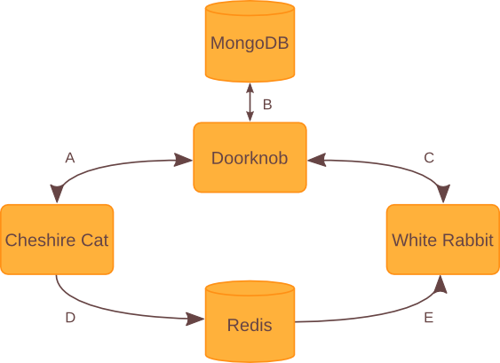

Introduction
============

Purpose
-------

Through this page, I hope to guide you, the reader, through all the stages of
the design and development of the Wonderland Engine. By doing this, I hope to
help you better understand the engine at a higher level, as well as some the
background behind the engine. Hopefully, you will find this useful in
determining whether the Wonderland Engine is right for your group or not, and
that it will serve future developers and administrators in understanding some
basic concepts behind the engine.

If you find any of the design descriptions confusing, I have included some UML
diagrams at the bottom of the page. My hope is that these diagrams will help
bring a greater understanding to the design itself.

Background
----------

Before any code was actually written, and before I had any idea that I would be
writing a scoring engine, I had started participating in the first teams that
my university, the University of Washington Bothell Campus, had sent to the
Pacific Rim Collegiate Cyber Defense Competition. While competing during the
2012 Competition, my team had done a pretty reasonable move and blocked any
incoming requests from outside our network from reaching the database, domain,
and intranet systems. For most systems, this is a very reasonable layout, but
unfortunately the database wasn't written to accommodate this.

The database that was in use up until that competition was hard coded to use
the public IPs of each system it was checking the uptime on. All these systems
were ones that it was not showing uptime for, even though technically, they
were up. As I learned later while designing this scoring engine, the paths were
hard coded, and in fact it took a significant amount of effort on the
competition organizer's part to set it up for new competitions such as the
smaller ones that my team started to participate in during the summer and fall
of 2012.

This wasn't the only problem, however. The database didn't have any concept of
'timed' checks (what I call inject checks). This meant that judges had to
receive paper instructions on how to run scripts installed on each competition
machine and interpret the output themselves. It also didn't have any concept of
checks which could subtract points for attackers successfully being able to
break in to the systems that teams are supposed to protect. It didn't even
support IPv6, which will become very important in the next few years.

This is why I decided that, for my Cooperative Education project that was
required for me to graduate from University of Washington Bothell's CSSE
program, I would create a new engine to replace the old one. I worked closely
with the people who set up the PRCCDC event every year as well as the
aforementioned smaller competitions to design it how they needed it. Throughout
the lifecycle of this project, I have learned many new skills in both python
and project management that I hope to use in future jobs. I hope to continue
working on this in the future.

Engine Design
-------------

The Wonderland Engine was created with modularity as the most crucial element
of its design. Before even starting on any code, I took a month to create a
50-page design document which described its architecture and each path that the
would have, including what was the input for that path and its output. This has
been incorporated into this documentation, although some elements of the
original design were changed along the span of developing the project.

One of the first design decisions I made was that the engine would utilize the
web using a REST-based architecture. My reasoning for this was that it would
need to be accessed across a large variety of systems, including Linux,
Windows, and eventually even Mac. It would be a pain for the system
administrator to have to set up a client on each workstation in order to allow
teams access to the scoring engine, so the next best setup was using a web
browser.

Another was that this would be utilizing a multilayer master-worker model in
order to run the checks that score the competition. This would be done from the
server itself, and wouldn't require any software to be installed on the client.
The only requirement would be that the server running the scoring engine would
have both a public IP on the competition environment, as well as a private IP
for each team's network. By utilizing this private IP, the engine would be able
to access the various team machines while allowing teams to maintain good
security practices.

Very early on, the scoring server was separated out into two different modules.
These were the scoring daemon (aka White Rabbit) and the REST server (aka
Cheshire Cat that gave access to the data that the scoring server generated.
Unfortunately, python servers are started with several processes, which forced
me to consider options for communication outside of traditional pipes. I
considered using sockets, but decided that wouldn't allow for the flexibility
that I needed. Eventually, I ended up using Redis's pub sub feature. By
utilizing this, the REST interface did not care about what daemon, if any, it
communicated with, and the daemon didn't care about what clients it was getting
its commands from. This allows for a more modular approach to detecting changes
across databases.

From these design decisions emerged the the three base components included with
the engine, Cheshire Cat, White Rabbit, and Doorknob. White Rabbit, as with the
character from the books, is mostly concerned with making sure that all the
checks run in a timely manner. Cheshire Cat just lazily takes the REST calls
and converts them into data to be submitted to or returned from the database,
and will occasionally notify White Rabbit that data it is concerned about in
the database has changed through Redis. Doorknob is the wrapper around the
database, which is where all the data for the scoring engine lives, and so,
again like the character from the book, can be considered the portal to
Wonderland itself. Details on each are available below.

Doorknob
--------

Doorknob was one of the first pieces of code to actually be created because, at
the time, I did not know whether I'd be using a SQL-based architecture such as
MySQL or PostgreSQL, or a NoSQL-based one with MongoDB. In addition, I knew
that not everyone would like to have to install MongoDB just for this engine,
so I decided that the database should be able to be swapped out for another if
so desired. Due to these desires, Doorknob came into existence.

One design approach I considered that would have worked great for MongoDB was
that I use an ORM model and encapsulate each type of object into a class
utilizing metaclasses for transforming them into database-level objects. Quite
a few good frameworks exist already for MongoDB, MySQL, and PostgreSQL, but
none allow for either of those to be used. In addition to the fact that ORMs
can be rather tricky when it comes to handling data that requires more than
one table in traditional SQL databases (thinking of things like key-value
stores or arrays), one that supported both SQL and NoSQL would only be able to
reliably support a few common object types such as ints and strings. This would
have spun out of control quickly, and would have made it harder for developers
to create new wrappers for their preferred database.

Instead, I decided to create an abstract class that contained an abstract
method for each action either White Rabbit or Cheshire Cat would need. These
would have the arguments that they needed and be able to interpret them
accordingly depending on the database in use. If you wanted to support a
different database, all you'd have to do is inherit from the DBWrapper class
and implement all the abstract methods that it creates. With this technique,
what the DBWrapper does and doesn't support can be adequately specified and
it would require minimal conceptual confusion from the developer.

However, this approach does have its downsides too. In terms of amount of code,
this approach generates a lot more, with DBWrapper containing 88 methods at the
time of this writing. However, many of those do similar things but with
different sets of data (such as users vs machines). This may have been able to
be handled in a more object-oriented way, with different classes that inherit
from a common class, for example, but allowing that common class to be dynamic
and deciding how it would be abstract enough to work across different databases
would have presented similar problems to an ORM-style model. Due to these
conceptual downsides, I took the KISS (Keep It Super Simple) approach and
used one method per action per set of data.

Cheshire Cat
------------

Cheshire Cat was created as an easy way to access the data across the many
machines that would inevitably be deployed for Cyber Defense Competitions. By
using a REST interface for the data, no special software would have to be
deployed to any machines in order to communicate with the scoring engine. A web
frontend could be created to make AJAX calls to the scoring engine, which would
then work in any standard web browser. Plus, by using a REST interface, the
scoring engine can be located on a separate machine from the actual 

UML Diagrams
------------

I have included these UML diagrams in order to facilitate the understanding of
the designs mentioned above. Included with each diagram is a description
describing each step in the diagram. Hopefully someone will find them helpful
in understanding the engine.

Engine Architecture
^^^^^^^^^^^^^^^^^^^

This image further emphasizes the three-pronged approach of the Wonderland
Engine, emphasizing the roles that each component takes and the communication
channels for each component. These communication channels are lettered, and
will be explained in the points that follow.

    **A:** Cheshire Cat pulls most of its information from Doorknob, the
    database wrapper. It may do some processing on the data before sending it
    back to the client, such as serializing some objects that are not normally
    JSON serializable (such as datetimes), but usually the data is as you would
    see it if you looked in the database. In addition, it does some data
    validation that would not be appropriate for the wrapper to do, such as
    checking that a role is in a set of defined roles for users.

    **B:** Doorknob does most of the heavy lifting by providing a common
    interface among databases in order to ease communication between both White
    Rabbit and Cheshire Cat and the database itself. One thing to note is that
    Doorknob does not have to communicate with MongoDB, as is pictured above. A
    wrapper for MongoDB is included by default, but any database with a wrapper
    that implements Doorknob's DBWrapper abstract class may be used instead. If
    you would like to use another database, feel free to write a new wrapper
    class and submit a patch!

    **C:** White Rabbit communicates with the database in order to store a list
    of loaded check modules and classes, and to get the list of checks to use
    for its checking processes. It also stores the score after running each
    check in the database, and recalculates the scores after each change.

    **D:** If certain portions of the database are changed that affect checking
    (such as the list of active checks in the database), Cheshire Cat will
    publish a command to a Redis pub sub channel specified in the Engine config
    file. This allows for any program listening on that channel to receive and
    interpret any sent commands as they wish, regardless of programming
    language or implementation.

    **E:** White Rabbit listens to the Redis pub sub channel specified in the
    Engine's config file for commands that signal changes it should enact on.
    These changes could include the list of checks being changed, or whether
    to start or stop checking. If you would like more information on this,
    please see the documentation for :doc:`Doorknob </doorknob/index>`.

Unfortunately, due to time constraints, D and E (the communication through
Redis's pub sub channels) are hard coded into both Cheshire Cat and White
Rabbit. I would like to abstract this out too, so that you could use other
pub sub providers (such as ZeroMQ) without much hassle. If you would like this,
feel free to file a new issue on the Github tracker and propose a design!